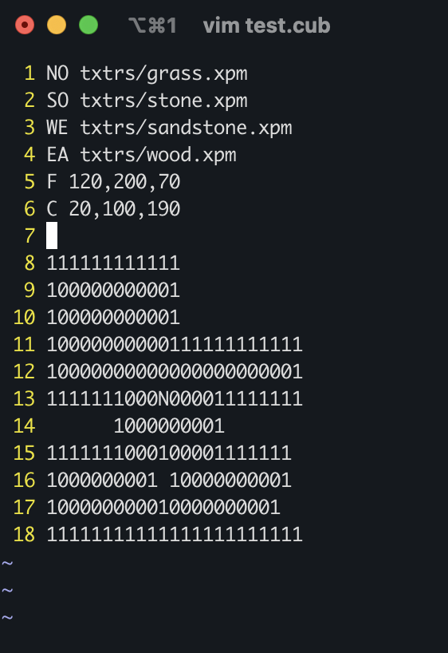

# cub3d: A Raycasting Initiation

## Description

`cub3d` is a first-person 3D graphical game that renders a simple environment using raycasting. It is inspired by the classic *Wolfenstein 3D* and draws on concepts from [Permadi's documentation on raycasting](https://permadi.com/1996/05/ray-casting-tutorial-1/). The player can move around the map and interact with the environment from a first-person perspective. The project is implemented using the `MiniLibX` (MLX) graphics library and uses raycasting for real-time rendering of the environment.


## Mathematical Concepts

To achieve the 3D perspective rendering, several key mathematical concepts are used:

- **Raycasting:** Each frame of the game casts rays from the player's position into the scene. The distance to the nearest wall determines how "tall" that wall appears on the screen.

1. **Distance to the Wall:** The Euclidean distance formula is used to find the distance between the player's position and the wall hit point:

$$
\text{distance} = \sqrt{(x_{\text{player}} - x_{\text{wall}})^2 + (y_{\text{player}} - y_{\text{wall}})^2}
$$

2. **Angle Adjustments:** The angle of each ray is computed relative to the player's viewing direction. The angle of the player's field of view (FOV) is divided into narrow slices, and a ray is cast for each slice.

$$
\text{ray angle} = \text{player angle} - \frac{\text{FOV}}{2} + (\text{slice index} \times \text{slice width})
$$

3. **Fish-eye Correction:** To remove the fish-eye distortion effect caused by different angles, the following correction is applied:

$$
\text{corrected distance} = \text{distance} \times \cos(\text{ray angle} - \text{player angle})
$$

4. **Wall Height Calculation:** Once the corrected distance is obtained, the height of the wall on the screen is calculated based on the projection plane and the distance:

$$
\text{wall height} = \frac{\text{tile size}}{\text{corrected distance}} \times \text{projection plane distance}
$$

The projection plane distance is calculated as:

$$
\text{projection plane distance} = \frac{\text{screen width}}{2 \times \tan\left(\frac{\text{FOV}}{2}\right)}
$$

These formulas drive the entire rendering system, from casting rays to drawing walls at the appropriate heights on the screen.

## Features

- **Raycasting engine:** Implements a 2D grid to render a 3D projection of walls.
- **Player movement:** Allows the player to move in all directions and rotate the view.
- **Textured walls:** The game supports textured walls using `.xpm` files.
- **Error handling:** Includes checks for map format errors, file accessibility, and color values.
- **Flood fill:** Ensures the map is fully enclosed and valid for gameplay.

## Compilation and Usage

### Compilation

To compile the project, run the following command in the root directory:

```bash
make
```

This will generate the `cub3d` executable.

### Usage

To run the game, provide a map file in `.cub` format as an argument:

```bash
./cub3d [path_to_map.cub]
```

Example:
```bash
./cub3d ./test.cub
```

### Map Format

The map must be a `.cub` file and follow these rules:

- Must be enclosed by walls (`1`).
- Can contain empty spaces (`0`), walls (`1`), player positions (`N`, `S`, `E`, `W`), and textures for different walls.
- Player must be placed in one of the starting positions (`N`, `S`, `E`, `W`).

### Example map (`test.cub`):

```
NO txtrs/grass.xpm
SO txtrs/stone.xpm
WE txtrs/sandstone.xpm
EA txtrs/wood.xpm
F 120,200,70
C 20,100,190

111111111111
100000000001
100000000001
10000000000111111111111
10000000000000000000001
1111111000N000011111111
      1000000001
1111111000100001111111
1000000001 10000000001
100000000010000000001
11111111111111111111111
```



#### Map's Breakdown:

1. **Textures:**

	- `NO txtrs/grass.xpm:` This assigns the texture for the **north** wall to the `grass.xpm` file located in the `txtrs/` directory.
	- `SO txtrs/stone.xpm:` This assigns the texture for the **south** wall to the `stone.xpm` file located in the `txtrs/` directory.
	- `WE txtrs/sandstone.xpm:` This assigns the texture for the **west** wall to the `sandstone.xpm` file located in the `txtrs/` directory.
	- `EA txtrs/wood.xpm:` This assigns the texture for the **east** wall to the `wood.xpm` file located in the `txtrs/` directory.

2. **Colors:**
	- `F 120,200,70:` This sets the **floor color** to an RGB value of `(120, 200, 70)`, which is a shade of green.
	- `C 20,100,190:` This sets the **ceiling color** to an RGB value of `(20, 100, 190)`, which is a shade of blue.

3. **Map:**
	- `1`: Wall
	- `0`: Empty space (walkable)
	- `N`: Player starts facing North

## Controls

- `W`: Move forward
- `A`: Move left
- `S`: Move backward
- `D`: Move right
- `Arrow keys`: Rotate view
- `ESC`: Exit the game

## Error Handling

- **Map validation:** Ensures that the map is enclosed by walls and has valid elements.
- **Argument checking:** Verifies the correctness of the input arguments and file structure.
- **Texture loading:** Checks if all textures are available and properly formatted.

## Author

Project developed by [Emin A.](https://github.com/emayia) as part of the École 42 curriculum.

Special thanks to my dear brother [Malik I.](https://github.com/ma1iik) for his precious guidance and help.
